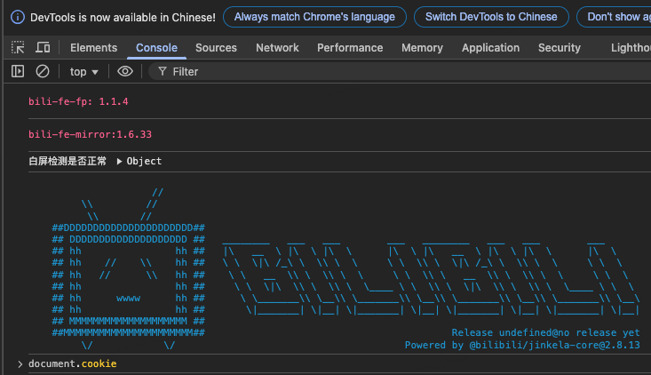

# BBDown
> BiliBili 视频下载工具。

```

 _______    _______    ______         ,-----.    .--.      .--.,---.   .--. 
\  ____  \ \  ____  \ |    _ `''.   .'  .-,  '.  |  |_     |  ||    \  |  | 
| |    \ | | |    \ | | _ | ) _  \ / ,-.|  \ _ \ | _( )_   |  ||  ,  \ |  | 
| |____/ / | |____/ / |( ''_'  ) |;  \  '_ /  | :|(_ o _)  |  ||  |\_ \|  | 
|   _ _ '. |   _ _ '. | . (_) `. ||  _`,/ \ _/  || (_,_) \ |  ||  _( )_\  | 
|  ( ' )  \|  ( ' )  \|(_    ._) ': (  '\_/ \   ;|  |/    \|  || (_ o _)  | 
| (_{;}_) || (_{;}_) ||  (_.\.' /  \ `"/  \  ) / |  '  /\  `  ||  (_,_)\  | 
|  (_,_)  /|  (_,_)  /|       .'    '. \_/``".'  |    /  \    ||  |    |  | 
/_______.' /_______.' '-----'`        '-----'    `---'    `---`'--'    '--' 
                                                                            

```

# 环境配置
安装音视频处理工具 `ffmpeg`。
```bash
pip install ffmpeg-python
```

# 变量配置
## Cookie
网页端登录 Bilibili，按 F12 打开开发者工具，在控制台输入 `document.cookie` 


## 视频 ID
编辑器打开 config.yml，在 `bid` 下填入需要下载的视频的 `bid`。

`bid` 获取方式：

网页端任意打开一个视频，其 url 形如：

> https://www.bilibili.com/video/bid/xxxxxxxxxx

复制其中的 `bid`。

## 是否保留源文件
BiliBili 的视频通常是视频与音频分离的，下载后会有两个文件。

如果需要保留源文件，将 `keep_source` 设为 `true`，设置为 `False` 经过 `ffmpeg` 合并成有声视频后会删除。

默认配置为 `False`。

最后的配置如下：
```yaml
bid:
  - bid0
  - bid1
  - bid2
  - ...

reserve_source: False
```

下载的视频位于 `download_videos` 目录。

# 参考
[Python爬虫：爬取B站视频（最新、能用且讲解详细）【01】](https://blog.csdn.net/knighthood2001/article/details/139014757)